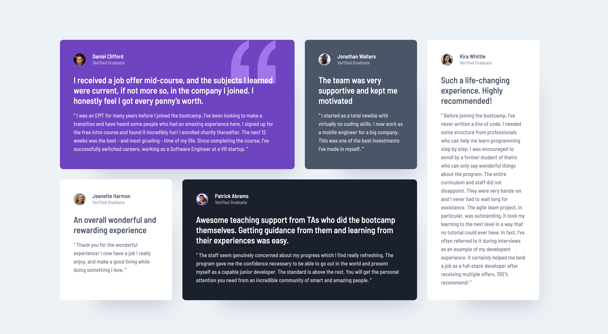

# Frontend Mentor - Testimonials grid section solution

This is a solution to the [Testimonials grid section challenge on Frontend Mentor](https://www.frontendmentor.io/challenges/testimonials-grid-section-Nnw6J7Un7). Frontend Mentor challenges help you improve your coding skills by building realistic projects.

## Table of contents

- [Overview](#overview)
  - [The challenge](#the-challenge)
  - [Screenshot](#screenshot)
  - [Links](#links)
- [My process](#my-process)
  - [Built with](#built-with)
  - [What I learned](#what-i-learned)
  - [Continued development](#continued-development)
  - [Useful resources](#useful-resources)
- [Author](#author)
- [Acknowledgments](#acknowledgments)

**Note: Delete this note and update the table of contents based on what sections you keep.**

## Overview

### The challenge

Users should be able to:

- View the optimal layout for the site depending on their device's screen size

### Screenshot



### Links

- [Solution URL here](https://github.com/lgwarda/testimonials-grid-section.git)
- [Live site URL here](https://lgwarda.github.io/testimonials-grid-section/)

## My process

### Built with

- Semantic HTML5 markup
- CSS custom properties
- CSS Grid

### What I learned

1. CUBE CSS Methodology
   Modular Structure: Using CUBE CSS helped organize your styles into logical, reusable blocks (Composition, Utility, Block, and Exception). This approach made code modular and maintainable.

```scss
// composition/_layouts.scss
.testimonial-grid {
  display: grid;
  gap: 1.5rem;
  padding-block: 2rem;
  width: min(95%, 70rem);
  margin-inline: auto;
}
```

2. Sass: Migration from @import to @use
   Migrating to @use improved your imports by reducing scope conflicts and setting you up for compatibility with Dart Sass 3.0.0.

```scss
// _layouts.scss
@use "../exceptions/exceptions" as *;
```

### Continued development

**Responsive Breakpoints**

- Expand Breakpoints: Consider adding more breakpoints for tablet-sized devices, extra-large screens, or even certain landscape orientations. This will help your designs adapt smoothly across a wider range of screen sizes.

- Refinement of Responsive Styles: Experiment with fine-tuning font sizes, paddings, and layout adjustments at each breakpoint to ensure an optimal viewing experience on all devices.

**Accessibility Best Practices**

- Incorporate accessibility considerations into responsive layouts, like ensuring text and interactive elements are easily readable and usable at any breakpoint.

### Useful resources

- [CUBE CSS](https://cube.fyi/) - This approach provided both structure and flexibility, making it a versatile choice for modern, scalable projects. I really appreciate this pattern and plan to use it in future work.

## Author

- Frontend Mentor - [@lgwarda](https://www.frontendmentor.io/profile/lgwarda)

## Acknowledgments

A big thank you to the Frontend Mentor community for providing great challenges that help sharpen my skills.
